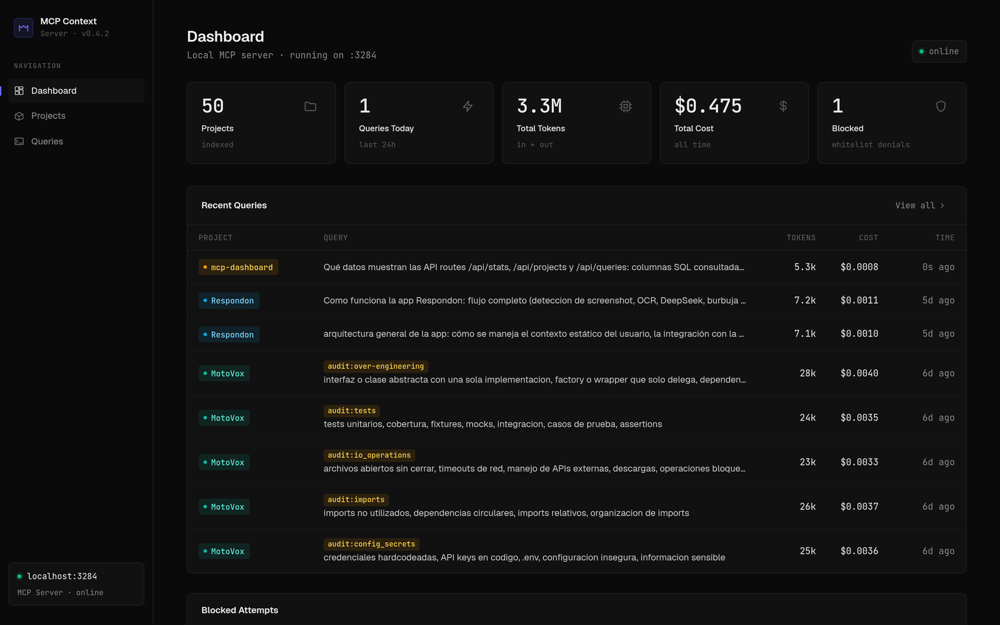
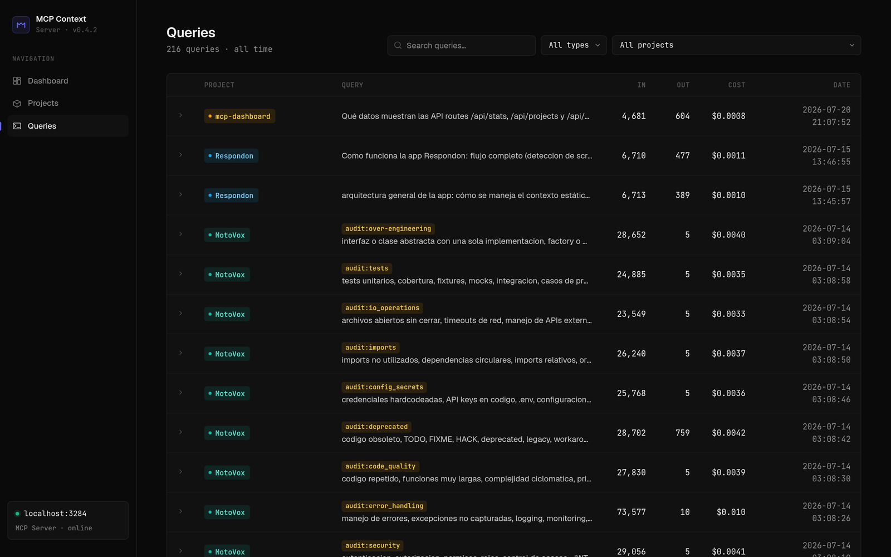
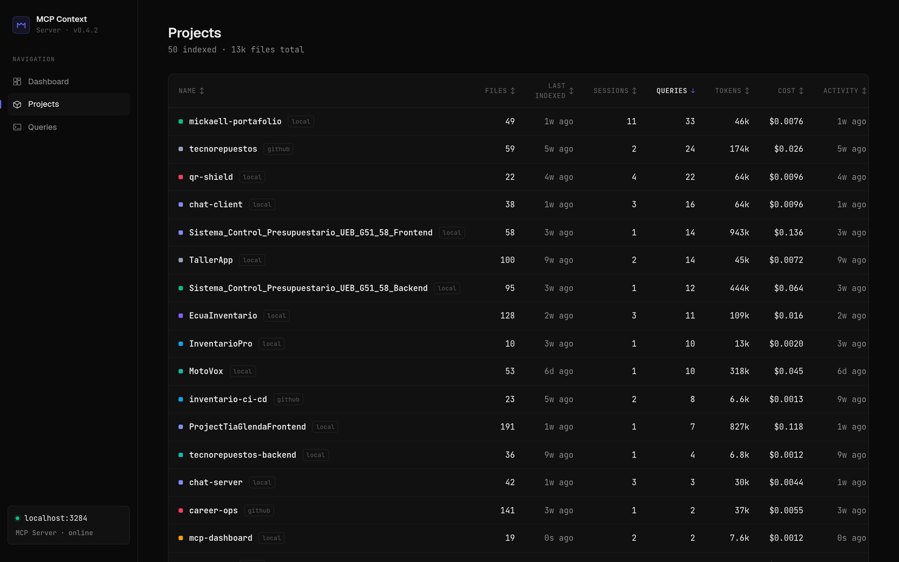

<div align="center">



<br/>


### Monitoreo en tiempo real del MCP Context Server

**Proyectos indexados, queries, auditorias, tokens y costo, directo del Postgres de Railway**
<br/>
**Dark theme terminal-nativo · sin dependencias de UI**

<br/>

[](https://github.com/Mickaell22/mcp-context-dashboard)

<br/>

[](#paginas)
[](#paginas)
[](#paginas)

<br/>

[](https://ia.novamicktools.com)

<br/>

[](https://nextjs.org)
[](https://typescriptlang.org)
[](https://railway.com)
[](https://railway.com)

[**Paginas**](#paginas) • [**Stack**](#stack) • [**Correr en local**](#correr-en-local) • [**Variables de entorno**](#variables-de-entorno) • [**Deploy**](#deploy) • [**Estructura**](#estructura)

</div>

---

## Paginas

| Pagina | Descripcion |
|---|---|
| `/` Dashboard | 5 stat cards (proyectos, queries hoy, tokens totales, costo total, intentos bloqueados) + ultimas 8 queries + panel de intentos bloqueados por whitelist |
| `/projects` Projects | Tabla de proyectos con origen (local/github), archivos indexados, ultimo indexado, sesiones, queries, costo y ultima actividad. Ordenable por cualquier columna. |
| `/queries` Queries | Historial paginado (20/pag) con filtro por tipo (query/audit), filtro por proyecto y busqueda por texto. Click en fila para expandir la query completa con su respuesta y metadata. Las auditorias del server se marcan con tag `audit:<categoria>`. |

<div align="center">

<br/><br/>

</div>

---

## Stack

- **Next.js 15** con App Router
- **TypeScript** estricto
- **`pg`** — conexion directa a PostgreSQL via API routes (server-side)
- **CSS custom** — dark theme con variables CSS, sin Tailwind
- **Geist + JetBrains Mono** — fuentes via Google Fonts

---

## Correr en local

```bash
git clone https://github.com/Mickaell22/mcp-context-dashboard
cd mcp-context-dashboard

npm install

cp .env.local.example .env.local
# editar .env.local con el DATABASE_URL de Railway
```

```bash
npm run dev
# → http://localhost:3000
```

---

## Variables de entorno

| Variable | Descripcion |
|---|---|
| `DATABASE_URL` | PostgreSQL de Railway. Usar la URL publica fuera de Railway, la interna dentro. |

---

## Deploy

El dashboard esta desplegado en Railway en el mismo proyecto que el Postgres del MCP server (`mcp-context`). El `DATABASE_URL` apunta al Postgres interno via red privada de Railway.

Cada push a `master` en GitHub dispara un redespliegue automatico en Railway.

---

## Estructura

```
mcp-dashboard/
├── app/
│   ├── layout.tsx          # Layout raiz con sidebar
│   ├── page.tsx            # Dashboard
│   ├── error.tsx           # Error boundary con stack trace
│   ├── projects/page.tsx   # Tabla de proyectos
│   ├── queries/page.tsx    # Historial de queries
│   └── api/
│       ├── stats/route.ts
│       ├── projects/route.ts
│       └── queries/route.ts
├── components/
│   ├── sidebar.tsx         # Nav lateral
│   ├── icons.tsx           # SVG icons inline
│   ├── skeleton.tsx        # Filas skeleton para estados de carga
│   └── project-badge.tsx   # Badge de proyecto con color determinista
└── lib/
    ├── db.ts               # Pool de conexion PostgreSQL
    └── format.ts           # Helpers: timeAgo, fmtNumber, fmtCost, colores
```
